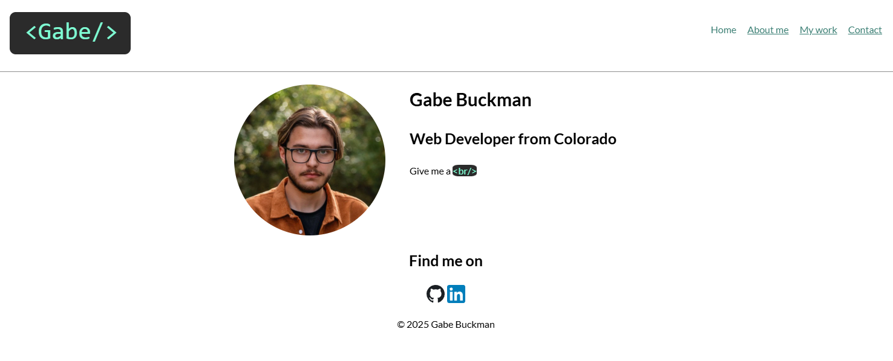

# Gabe’s Portfolio

A personal portfolio website built to showcase my skills, projects, and experience as a web developer.  
The site is fully responsive, accessible, and designed with a clean modern aesthetic.

---

## Overview

This portfolio serves as both a personal introduction and a professional showcase.  
It highlights my background, technical skills, and key software development projects built during my full-stack development training.

### Key Sections
- **Home** – Brief introduction and site navigation  
- **About Me** – Bio, skill summary, and experience table  
- **My Work** – Interactive project gallery with links to live demos and GitHub repos  
- **Contact** – Email and social media links  

---

## Technologies Used

| Category | Tools / Frameworks |
|-----------|--------------------|
| **Frontend** | HTML5, CSS3, JavaScript |
| **Design** | Responsive layout with CSS Grid and Flexbox |
| **Accessibility** | WAI-ARIA roles, keyboard-friendly navigation |
| **Deployment** | GitHub Pages |
| **Assets** | Google Fonts (Lato), SVG icons |

---

## Features

- **Responsive Design:** Works seamlessly across desktop and mobile  
- **Accessible:** Uses semantic HTML and ARIA attributes  
- **Interactive UI:** Hover effects and transitions for a polished feel  
- **Project Gallery:** Displays key full-stack projects with live links  

---

## Projects Featured

### [MyFlix App](https://gb-myflix.netlify.app/)
Full-stack movie information app built with the MERN stack (MongoDB, Express, React, Node.js).  
Includes JWT authentication and API integration.

### [Meet App](https://meet-sigma-livid.vercel.app/)
Serverless React application using AWS Lambda and Google Calendar API to display upcoming events.

### [Portfolio Website](https://gabe-1byte.github.io/Gabes-Portfolio/)
Static portfolio showcasing responsive layout and professional design.
